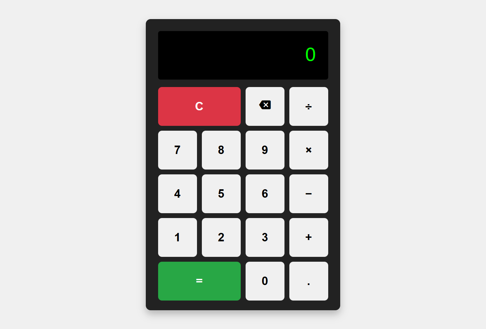

# 🔢 Simple Web Calculator

This is a basic calculator web application built using **HTML**, **CSS**, and **JavaScript**. It allows users to perform standard arithmetic operations like addition, subtraction, multiplication, and division through both mouse clicks and keyboard input. The calculator also supports **operator precedence**.

---

## 🚀 Features

- Interactive number and operator buttons
- Keyboard support (`0-9`, `+`, `-`, `*`, `/`, `Enter`, `Backspace`, `Escape`)
- Real-time input and result display
- Operator precedence handling (e.g., `2 + 3 * 4` = `14`)
- Error handling (e.g., division by zero, malformed expressions)
- Responsive layout using CSS Grid

---

## ⌨️ Keyboard Shortcuts

| Key            | Action            |
|----------------|-------------------|
| `0-9`          | Enter number       |
| `+`, `-`, `*`, `/` | Enter operator    |
| `Enter` or `=` | Calculate result   |
| `Backspace`    | Delete last input  |
| `Escape` or `C`| Clear screen       |
| `.`            | Add decimal point  |

---

## 📸 Screenshot

---

## 🛠️ How to Run

1. Clone or download this repository.
2. Open `index.html` in any modern web browser.

No build tools or dependencies required.

